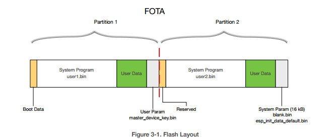

# OTA - Over the Air firmware update/upgrade

!!! Note: at this stage all notes here are preliminary (and make sense only to the author)

## ESP OTA

Basic idea of how the OTA update works: [Espressif FOTA guide](http://espressif.com/sites/default/files/documentation/99c-esp8266_fota_guide_en_.pdf)

The *storage* is partitioned into 2 (or more) sections. The first, yellow one, contains the bootloader. It will always be executed.

Upon execution, it will examine GPIO pins and also read variables (shared state) to decide from where to load the main *operating system*. Notice that the second yellow strip is "reserved"; so the partitioning is symmetric - but it is empty.

  - Q: is it really empty?

The main operating system is loaded into the main memory from user(1|2).bin.

  - Q: System params, are they always saved in the last 16kB of flash? I.e. SSID passwords.
  - Q: What is in User data?

## Update mechanisms

1. SDK OTA

Espressif has an upgrade API. It can download new firmware from interent and apply it (Espressif also provides a cloud service for distributing images, but the upgrade is not tight to the Espressif Cloud)

The API is:

  - system_upgrade_flag_check: to retrieve status (idle/start/finish)
  - system_upgrade_flag_set: to set the flags (idle/start/finish)
  - system_upgrade_reboot: reboot and run the new fmware
  - system_upgrade_userbin_check: determine which of the two images can be used (I'm not clear how it works)

## Glossary of important concepts

### SDK/toolchain

The toolchain is there to compile the software into the native machine code (i.e. instructions understood by the chip). SDK also provides libraries (ie. cryptography, timers) and the *bootloader*.

  - Q: Can rBoot (or any other boot loader) work with ESP32 and ESP8266 chips? In other words: is the instruction set compatible?

For ESP8266 Espressif distributes their own SDKs, it has two variants:

  1. [RTOS](https://github.com/espressif/ESP8266_RTOS_SDK)
  2. [Callback based proprietary SDK](http://bbs.espressif.com/viewtopic.php?f=46&t=2376)

For both versions, the **APIs are interchangeable** (in theory). In both cases, Espressif distributes parts of the SDK only in binary form.

  - Q: I can't find the source repository of the NONOS SDK. Anybody knows?
  - Q: There is a lot of confusion about NONOS vs RTOS; I believe that NONOS for Espressif means 'modified RTOS'. For example [here](https://github.com/espressif/ESP8266_MP3_DECODER), they say the example runs with Non-OS SDK, but in the readme then state it is running modified RTOS. Anybody knows?

The new ESP32 has a new SDK (also based on FreeRTOS): https://github.com/espressif/esp-idf (and [Link to old SDK](https://github.com/espressif/ESP31_RTOS_SDK))

Nodemcu is built around NON-OS SDK 1.5.4.1 (which is based on FreeRTOS ([v7.5.2](http://www.freertos.org/a00106.html))). It uses the Espressif boot loader. The work on ESP32 has already started. [#1319](https://github.com/nodemcu/nodemcu-firmware/issues/1319)

Official download page: https://espressif.com/en/support/download/sdks-demos

### Microcontroller

Means *CPU with integrated memory* - so don't look for RAM; ESP chips have the microcontroller (CPU/RAM) + flash.

### ROM

ESP doesn't have ROM - only SRAM. Instead, it has SPI interface to communicate with SPI flash. So flash serves as ROM.

[Anatomy of the chip](https://electronicsworkbench.io/blog/esp8266-discovery)

## Booting (hardware view)

> Typically, every microprocessor will, after a reset or power-on condition, perform a start-up process that usually takes the form of "begin execution of the code that is found starting at a specific address" or "look for a multibyte code at a specific address and jump to the indicated location to begin execution". A system built using that microprocessor will have the permanent ROM occupying these special locations so that the system always begins operating without operator assistance. [Booting](https://en.wikipedia.org/wiki/Booting)

### Bootloader

Small piece of assembly code which loads main 'operationg sytem' and *finalizes* the boot sequence. It is loaded from a fixed location.

  - Q: Is it the bootloader that examines GPIO pins?
  - Q: Can it be written in C?
  - Q: @raburton says that ESP's bootloader blocks 144 bytes of RAM but rBoot 0 bytes; how is that done? Does it do `chain loading`? If yes, where is the `common data area` (shared variables, state)?
  - Q: the assembly instructions depend on the chip (ESP8266 vs ESP32), is it possible to have one bootloader supporting both?
  - Q: Does esp chip do any power-on self tests?

The new ESP32 SDK has bootloader source code:
  - https://github.com/espressif/esp-idf/tree/master/components/bootloader/src/main

### Persistent memory

In case of ESP it is the flash.

### Main memory

ESP8266 chip has 64KiB of memory for the main application. 96KiB RAM for user application. ESP32 has 520KiB RAM memory.

### Booting starting

Read Only Memory is non-volatile, survives power shutdown. This is the place where the `bootstrap loader` has to be stored (and where the DPU is loading it from).

  - Q: Where in ESP (which address) is this?

### CPU

Important fact: ESP CPU's are based on modified Tensilica Diamond CPU. They are fully programmable on microcode level. Espressif created their own processors instructions (many unknown/undocumented). [source](https://electronicsworkbench.io/blog/esp8266-discovery)

ESP8266 has only one core, but ESP32 is dual core. The bootloader has to initialize at least one core.

  - Q: Will this affect the boot loader?

### SPI Flash

### SPIFF

SPIFF is a filesystem. TODO...

### ELF

  (I don't yet know what that is/means)

### Compilation

The source code is compiled into object files, then linked into an ELF formatted executable. Then split into two parts:

  1. data to load into RAM
  2. data to make available via addressable flash memory

  - Q: What is addressable Flash memory?
  - Q: How big it can be?
